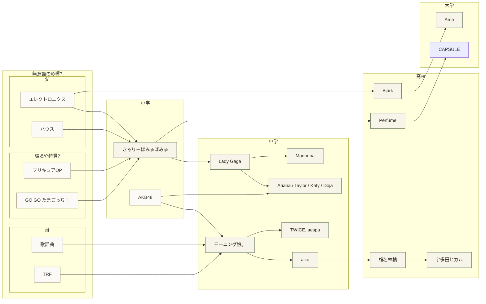

音楽・文学・哲学のつながりを、図とメモで管理するページです。

### 音楽系譜（下書き）



- 実線 `-->`: 影響の流れ
- 点線 `-.->`: 併走・間接的な接続

### 年代メモ

- 2018: （ここに記入）
- 2019: （ここに記入）
- 2020: （ここに記入）
- 2021: （ここに記入）

### 追加メモ

- 図を増やすときは ` ```mermaid ` ブロックを追加
- 図と本文を分けたいときは、見出しを増やして整理
- 引用を使う場合は出典を明記
